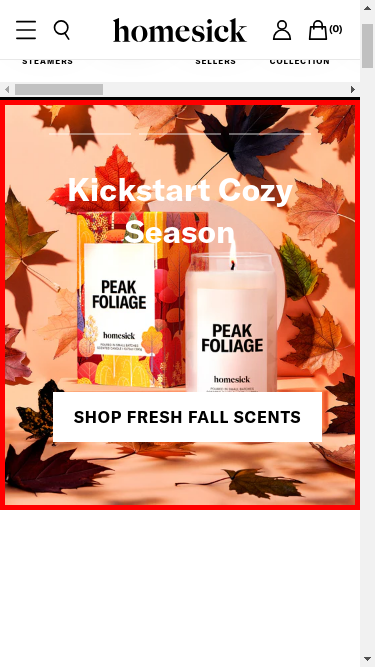
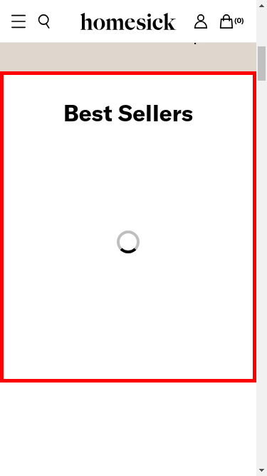
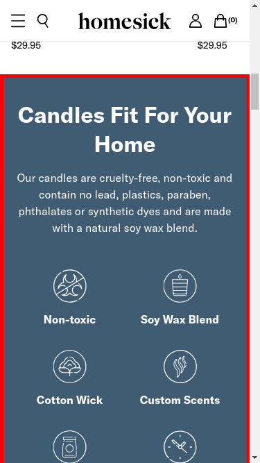
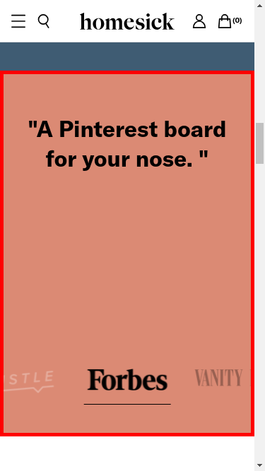
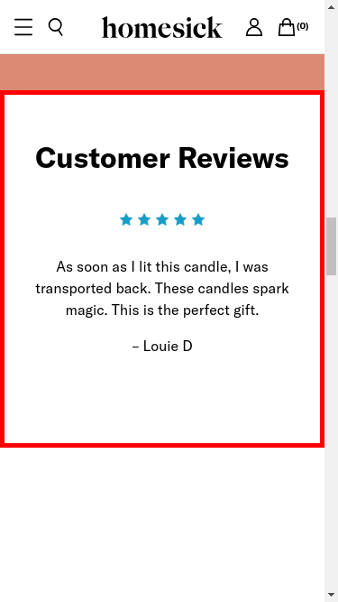
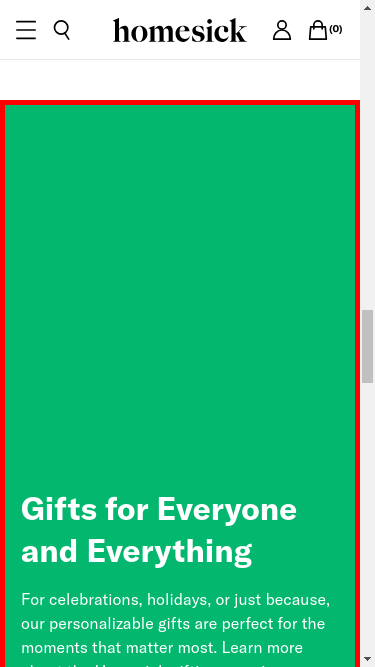

<html><head>
</head><body>
            

                

                    <h2>Component 000</h2>
                    
                

                

                    <pre>
                        <code>
                        {
  "element_purpose": "progress-half-media",
  "colors": {
    "background_color": "var(--background)",
    "media_background_color": "rgb(255, 255, 255)",
    "content_background_color": "transparent"
  },
  "images": [
    {
      "src": "https://cdn.shopify.com/s/files/1/0987/6688/files/Hero-Desktop_5bbb4d12-ae67-4702-ab0a-d89f5f64bd78.jpg?v=1723731322&amp;width=100&amp;height=100&amp;crop=center",
      "width": 100,
      "height": 100,
      "srcset": [
        "https://cdn.shopify.com/s/files/1/0987/6688/files/Hero-Desktop_5bbb4d12-ae67-4702-ab0a-d89f5f64bd78.jpg?v=1723731322&amp;width=200&amp;height=200&amp;crop=center 200w",
        "https://cdn.shopify.com/s/files/1/0987/6688/files/Hero-Desktop_5bbb4d12-ae67-4702-ab0a-d89f5f64bd78.jpg?v=1723731322&amp;width=600&amp;height=600&amp;crop=center 600w",
        "https://cdn.shopify.com/s/files/1/0987/6688/files/Hero-Desktop_5bbb4d12-ae67-4702-ab0a-d89f5f64bd78.jpg?v=1723731322&amp;width=1000&amp;height=1000&amp;crop=center 1000w",
        "https://cdn.shopify.com/s/files/1/0987/6688/files/Hero-Desktop_5bbb4d12-ae67-4702-ab0a-d89f5f64bd78.jpg?v=1723731322&amp;width=1400&amp;height=1400&amp;crop=center 1400w",
        "https://cdn.shopify.com/s/files/1/0987/6688/files/Hero-Desktop_5bbb4d12-ae67-4702-ab0a-d89f5f64bd78.jpg?v=1723731322&amp;width=1800&amp;height=1800&amp;crop=center 1800w",
        "https://cdn.shopify.com/s/files/1/0987/6688/files/Hero-Desktop_5bbb4d12-ae67-4702-ab0a-d89f5f64bd78.jpg?v=1723731322&amp;width=2200&amp;height=2200&amp;crop=center 2200w",
        "https://cdn.shopify.com/s/files/1/0987/6688/files/Hero-Desktop_5bbb4d12-ae67-4702-ab0a-d89f5f64bd78.jpg?v=1723731322&amp;width=2600&amp;height=2600&amp;crop=center 2600w",
        "https://cdn.shopify.com/s/files/1/0987/6688/files/Hero-Desktop_5bbb4d12-ae67-4702-ab0a-d89f5f64bd78.jpg?v=1723731322&amp;width=3000&amp;height=3000&amp;crop=center 3000w"
      ],
      "alt": "",
      "decoding": "async",
      "loading": "lazy",
      "class": "bg-offWhite object-cover media-fill",
      "style": {
        "width": "100%",
        "aspectRatio": "1 / 1"
      }
    }
  ]
}
                        </code>
                    </pre>
                

            

            

                

                    <h2>Component 001</h2>
                    
                

                

                    <pre>
                        <code>
                        {
  "element_purpose": "products-slider",
  "colors": [
    "currentcolor"
  ],
  "images": []
}
                        </code>
                    </pre>
                

            

            

                

                    <h2>Component 002</h2>
                    
                

                

                    <pre>
                        <code>
                        {
  "element_purpose": "Display product features of candles in a visually appealing manner, including their benefits and key characteristics.",
  "colors": {
    "background_color": "rgb(63, 92, 115)",
    "text_color": "var(--white)",
    "icon_background_color": "bg-offWhite",
    "icon_background_color_alternative": "bg-transparent"
  },
  "images": [
    {
      "alt": "Non-toxic",
      "src": "https://cdn.shopify.com/s/files/1/0987/6688/files/Vector.svg?v=1717792980&width=48&height=48&crop=center",
      "srcset": [
        "https://cdn.shopify.com/s/files/1/0987/6688/files/Vector.svg?v=1717792980&width=48&height=48&crop=center 1x",
        "https://cdn.shopify.com/s/files/1/0987/6688/files/Vector.svg?v=1717792980&width=96&height=96&crop=center 2x",
        "https://cdn.shopify.com/s/files/1/0987/6688/files/Vector.svg?v=1717792980&width=144&height=144&crop=center 3x"
      ]
    },
    {
      "alt": "Soy Wax Blend",
      "src": "https://cdn.shopify.com/s/files/1/0987/6688/files/image_20_281_29.svg?v=1717625101&width=48&height=48&crop=center",
      "srcset": [
        "https://cdn.shopify.com/s/files/1/0987/6688/files/image_20_281_29.svg?v=1717625101&width=48&height=48&crop=center 1x",
        "https://cdn.shopify.com/s/files/1/0987/6688/files/image_20_281_29.svg?v=1717625101&width=96&height=96&crop=center 2x",
        "https://cdn.shopify.com/s/files/1/0987/6688/files/image_20_281_29.svg?v=1717625101&width=144&height=144&crop=center 3x"
      ]
    },
    {
      "alt": "Cotton Wick",
      "src": "https://cdn.shopify.com/s/files/1/0987/6688/files/image_20_283_29.svg?v=1717625109&width=48&height=48&crop=center",
      "srcset": [
        "https://cdn.shopify.com/s/files/1/0987/6688/files/image_20_283_29.svg?v=1717625109&width=48&height=48&crop=center 1x",
        "https://cdn.shopify.com/s/files/1/0987/6688/files/image_20_283_29.svg?v=1717625109&width=96&height=96&crop=center 2x",
        "https://cdn.shopify.com/s/files/1/0987/6688/files/image_20_283_29.svg?v=1717625109&width=144&height=144&crop=center 3x"
      ]
    },
    {
      "alt": "Custom Scents",
      "src": "https://cdn.shopify.com/s/files/1/0987/6688/files/image_20_284_29.svg?v=1717625108&width=48&height=48&crop=center",
      "srcset": [
        "https://cdn.shopify.com/s/files/1/0987/6688/files/image_20_284_29.svg?v=1717625108&width=48&height=48&crop=center 1x",
        "https://cdn.shopify.com/s/files/1/0987/6688/files/image_20_284_29.svg?v=1717625108&width=96&height=96&crop=center 2x",
        "https://cdn.shopify.com/s/files/1/0987/6688/files/image_20_284_29.svg?v=1717625108&width=144&height=144&crop=center 3x"
      ]
    },
    {
      "alt": "Reusable Glass Jars",
      "src": "https://cdn.shopify.com/s/files/1/0987/6688/files/image_20_285_29.svg?v=1717625105&width=48&height=48&crop=center",
      "srcset": [
        "https://cdn.shopify.com/s/files/1/0987/6688/files/image_20_285_29.svg?v=1717625105&width=48&height=48&crop=center 1x",
        "https://cdn.shopify.com/s/files/1/0987/6688/files/image_20_285_29.svg?v=1717625105&width=96&height=96&crop=center 2x",
        "https://cdn.shopify.com/s/files/1/0987/6688/files/image_20_285_29.svg?v=1717625105&width=144&height=144&crop=center 3x"
      ]
    },
    {
      "alt": "60-80 Hour Burn time",
      "src": "https://cdn.shopify.com/s/files/1/0987/6688/files/image_20_286_29.svg?v=1717625103&width=48&height=48&crop=center",
      "srcset": [
        "https://cdn.shopify.com/s/files/1/0987/6688/files/image_20_286_29.svg?v=1717625103&width=48&height=48&crop=center 1x",
        "https://cdn.shopify.com/s/files/1/0987/6688/files/image_20_286_29.svg?v=1717625103&width=96&height=96&crop=center 2x",
        "https://cdn.shopify.com/s/files/1/0987/6688/files/image_20_286_29.svg?v=1717625103&width=144&height=144&crop=center 3x"
      ]
    }
  ]
}
                        </code>
                    </pre>
                

            

            

                

                    <h2>Component 003</h2>
                    
                

                

                    <pre>
                        <code>
                        {
  "element_purpose": "press-slider",
  "colors": [
    "rgb(219, 138, 116)",
    "var(--text)",
    "offWhite",
    "transparent"
  ],
  "images": [
    {
      "alt": "Press logo",
      "src": "https://cdn.shopify.com/s/files/1/0987/6688/files/image_2098.png?v=1717793089&width=128&height=41&crop=center",
      "srcset": [
        "https://cdn.shopify.com/s/files/1/0987/6688/files/image_2098.png?v=1717793089&width=128&height=41&crop=center 1x",
        "https://cdn.shopify.com/s/files/1/0987/6688/files/image_2098.png?v=1717793089&width=256&height=82&crop=center 2x",
        "https://cdn.shopify.com/s/files/1/0987/6688/files/image_2098.png?v=1717793089&width=384&height=123&crop=center 3x"
      ]
    },
    {
      "alt": "Press logo",
      "src": "https://cdn.shopify.com/s/files/1/0629/5519/2520/files/forbes-logo-small.png?v=1702422887&width=128&crop=center",
      "srcset": [
        "https://cdn.shopify.com/s/files/1/0629/5519/2520/files/forbes-logo-small.png?v=1702422887&width=128&crop=center 1x",
        "https://cdn.shopify.com/s/files/1/0629/5519/2520/files/forbes-logo-small.png?v=1702422887&width=256&crop=center 2x",
        "https://cdn.shopify.com/s/files/1/0629/5519/2520/files/forbes-logo-small.png?v=1702422887&width=384&crop=center 3x"
      ]
    },
    {
      "alt": "Press logo",
      "src": "https://cdn.shopify.com/s/files/1/0629/5519/2520/files/vanity-fair-logo-small.png?v=1702422889&width=128&crop=center",
      "srcset": [
        "https://cdn.shopify.com/s/files/1/0629/5519/2520/files/vanity-fair-logo-small.png?v=1702422889&width=128&crop=center 1x",
        "https://cdn.shopify.com/s/files/1/0629/5519/2520/files/vanity-fair-logo-small.png?v=1702422889&width=256&crop=center 2x",
        "https://cdn.shopify.com/s/files/1/0629/5519/2520/files/vanity-fair-logo-small.png?v=1702422889&width=384&crop=center 3x"
      ]
    },
    {
      "alt": "Press logo",
      "src": "https://cdn.shopify.com/s/files/1/0987/6688/files/USA_Today.Logo.White_copy_130x41_90734bea-0599-43be-9452-e8ea70514f3c.webp?v=1717625695&width=128&height=41&crop=center",
      "srcset": [
        "https://cdn.shopify.com/s/files/1/0987/6688/files/USA_Today.Logo.White_copy_130x41_90734bea-0599-43be-9452-e8ea70514f3c.webp?v=1717625695&width=128&height=41&crop=center 1x",
        "https://cdn.shopify.com/s/files/1/0987/6688/files/USA_Today.Logo.White_copy_130x41_90734bea-0599-43be-9452-e8ea70514f3c.webp?v=1717625695&width=256&height=82&crop=center 2x",
        "https://cdn.shopify.com/s/files/1/0987/6688/files/USA_Today.Logo.White_copy_130x41_90734bea-0599-43be-9452-e8ea70514f3c.webp?v=1717625695&width=384&height=123&crop=center 3x"
      ]
    }
  ]
}
                        </code>
                    </pre>
                

            

            

                

                    <h2>Component 004</h2>
                    
                

                

                    <pre>
                        <code>
                        {
  "element_purpose": "testimonial-slider",
  "colors": {
    "background": "var(--background)",
    "heading_text": "var(--black)",
    "testimonial_text": "var(--black)",
    "star": "var(--accent1)",
    "pagination_bullet": "var(--white)",
    "button_background": "bg-white",
    "button_icon": "text-black"
  },
  "images": [
    "/svgs/star-full.svg#star-full",
    "/svgs/arrow-left.svg#arrow-left",
    "/svgs/arrow-right.svg#arrow-right"
  ]
}
                        </code>
                    </pre>
                

            

            

                

                    <h2>Component 005</h2>
                    
                

                

                    <pre>
                        <code>
                        {
  "element_purpose": "To promote gifts for various occasions, highlighting personalizable items and providing a call-to-action to shop all products.",
  "colors": [
    "rgb(3, 183, 110)",
    "var(--white)",
    "offWhite"
  ],
  "images": [
    {
      "alt": "Man with backpack crossing the street",
      "src": "https://cdn.shopify.com/s/files/1/0987/6688/files/HMS.Holiday.Gifting.2022.Hero.1_1440x_6e1a3daa-c440-445e-bfc2-971c925a3b69.webp?v=1717626356&width=100&height=100&crop=center",
      "srcset": [
        "https://cdn.shopify.com/s/files/1/0987/6688/files/HMS.Holiday.Gifting.2022.Hero.1_1440x_6e1a3daa-c440-445e-bfc2-971c925a3b69.webp?v=1717626356&width=200&height=200&crop=center 200w",
        "https://cdn.shopify.com/s/files/1/0987/6688/files/HMS.Holiday.Gifting.2022.Hero.1_1440x_6e1a3daa-c440-445e-bfc2-971c925a3b69.webp?v=1717626356&width=600&height=600&crop=center 600w",
        "https://cdn.shopify.com/s/files/1/0987/6688/files/HMS.Holiday.Gifting.2022.Hero.1_1440x_6e1a3daa-c440-445e-bfc2-971c925a3b69.webp?v=1717626356&width=1000&height=1000&crop=center 1000w",
        "https://cdn.shopify.com/s/files/1/0987/6688/files/HMS.Holiday.Gifting.2022.Hero.1_1440x_6e1a3daa-c440-445e-bfc2-971c925a3b69.webp?v=1717626356&width=1400&height=1400&crop=center 1400w",
        "https://cdn.shopify.com/s/files/1/0987/6688/files/HMS.Holiday.Gifting.2022.Hero.1_1440x_6e1a3daa-c440-445e-bfc2-971c925a3b69.webp?v=1717626356&width=1800&height=1800&crop=center 1800w",
        "https://cdn.shopify.com/s/files/1/0987/6688/files/HMS.Holiday.Gifting.2022.Hero.1_1440x_6e1a3daa-c440-445e-bfc2-971c925a3b69.webp?v=1717626356&width=2200&height=2200&crop=center 2200w",
        "https://cdn.shopify.com/s/files/1/0987/6688/files/HMS.Holiday.Gifting.2022.Hero.1_1440x_6e1a3daa-c440-445e-bfc2-971c925a3b69.webp?v=1717626356&width=2600&height=2600&crop=center 2600w",
        "https://cdn.shopify.com/s/files/1/0987/6688/files/HMS.Holiday.Gifting.2022.Hero.1_1440x_6e1a3daa-c440-445e-bfc2-971c925a3b69.webp?v=1717626356&width=3000&height=3000&crop=center 3000w"
      ]
    }
  ]
}
                        </code>
                    </pre>
                

            

            

                

                    <h2>Component 006</h2>
                    
                

                

                    <pre>
                        <code>
                        {
  "element_purpose": "This HTML fragment represents a section of a Shopify app that includes a storefront logo, social media links, navigation links to various pages like About Us, Wholesale, and Blog, a subscription form for newsletters, and a footer with copyright information.",
  "colors": [
    "black",
    "white",
    "current"
  ],
  "images": [
    "/svgs/logo.svg#logo",
    "/svgs/social/instagram.svg#instagram",
    "/svgs/social/facebook.svg#facebook"
  ]
}
                        </code>
                    </pre>
                

            
</body></html>
